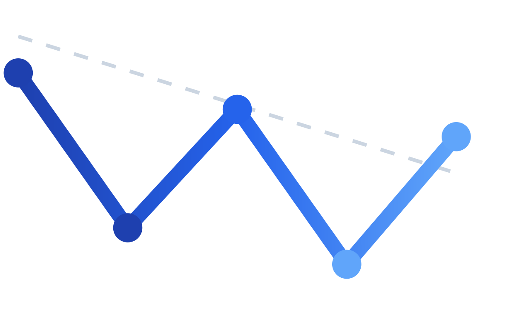

# WhichGLP

[WhichGLP.com](https://whichglp.com)

## Headlines

### Product

- **Addresses $100B+ market problem:** 72% of GLP-1 patients discontinue within 2 years, with lack of information or misaligned expectations playing a role

- **AI-powered platform:** Extracts structured data from 10k+ unstructured Reddit posts (cost, side effects, outcomes) and delivers personalized predictions based on user profile (age, location, insurance, health history)

- **User-validated:** Friend on Zepbound cited side effect preparedness as a major pain point his doctor didn't address; gathering broader user feedback for iteration

- **Built solo in 2 weeks** using AI-assisted development

### Engineering

- **Tech stack:** AI agent orchestration (Claude Sonnet 4.5 for code generation, GitHub Copilot + ChatGPT for code review, GLM-4.5-Air for feature extraction), Python FastAPI, Node.js, Redis, Supabase (PostgreSQL), Next.js, Vercel; designed to run autonomously at <$3/day

- **Performance:** Database optimization (materialized views, composite indexing, Redis caching) and frontend preconnecting achieve <0.2s Speed Index (best case), [0.7s Speed Index](https://pagespeed.web.dev/analysis/https-whichglp-com-compare/ddc3fk0bbf?form_factor=desktop) (average case), and Core Web Vitals scores (SI, LCP) superior to Google Search.

- **Cost optimization:** Switched from Claude Sonnet 4 and Haiku 3.5 to GLM-4.5-Air for feature extraction, reducing costs 90% from \\$30/day to <\\$3/day while maintaining extraction accuracy; gated API calls behind deterministic regex filters to eliminate 60% of irrelevant posts before AI processing

### Production Polish

- **Branding:** Memorable domain ([WhichGLP.com](https://whichglp.com)) that reflects user intent, custom logo and favicon reminiscent of a weight-loss trendline, and color palette inspired by GLP-1 drug brands

- **Marketing:** SEO (meta tags, OpenGraph), Google Search Console, professional email  (contact@whichglp.com)

- **Observability:** Google Analytics, Vercel Observability, Supabase analytics

- **Legal/Compliance:** Custom disclaimer, Terms of Service, and Privacy Policy addressing data collection, healthcare content, and AI-generated content

## Tech Stack

### Frontend Service

- **Framework:** Next.js 15 (App Router)
- **Language:** TypeScript (strict mode)
- **UI:** React 19, Tailwind CSS v4, Radix UI + shadcn/ui
- **API Client:** tRPC client, TanStack Query

### Backend Services

**1. API Service** (`apps/api`)
- **Runtime:** Node.js 20+
- **Language:** TypeScript (strict mode)
- **Framework:** tRPC (type-safe API)
- **Database:** Supabase client
- **Caching:** Redis (ioredis)
- **Port:** 8000

**2. Post Ingestion** (`apps/post-ingestion`)
- **Framework:** FastAPI + uvicorn
- **Language:** Python 3.13+
- **Data Source:** Reddit API (PRAW)
- **Database:** Supabase client
- **Function:** Fetch recent Reddit posts from GLP-1 subreddits

**3. Post Extraction** (`apps/post-extraction`)
- **Framework:** FastAPI + uvicorn
- **Language:** Python 3.13+
- **Database:** Supabase client
- **AI Model:** GLM-4.5-Air (via Z.ai SDK), a cost-effective model for simple text extraction, summarization, and sentiment analysis
- **Function:** Extract structured drug experience data from posts

**4. User Extraction** (`apps/user-extraction`)
- **Framework:** FastAPI + uvicorn
- **Language:** Python 3.13+
- **Database:** Supabase client
- **AI Model:** GLM-4.5-Air (via Z.ai SDK)
- **Function:** Extract user demographics from posts and comments

**5. Recommendation Engine** (`apps/rec-engine`)
- **Framework:** FastAPI + uvicorn
- **Language:** Python 3.13+
- **ML Stack:** scikit-learn (KNN), pandas, numpy
- **Function:** Generate personalized drug recommendations

### Infrastructure

**Vercel**
- **Frontend:** Next.js app deployed on Vercel

**Railway**
- **Caching:** Redis
- **Backend Services:** API, Post Ingestion, Post Extraction, User Extraction, Recommendation Engine
- **Cron Jobs:** Automated triggers that run every 2 days (Post Ingestion, Post Extraction, User Extraction, View Refresher)

**Supabase**
- **Database:** PostgreSQL

### Development

- **Python:** 3.13 with shared venv at repository root
- **Node.js:** 20+ for frontend and API service
- **Monorepo:** All services in `apps/` directory

